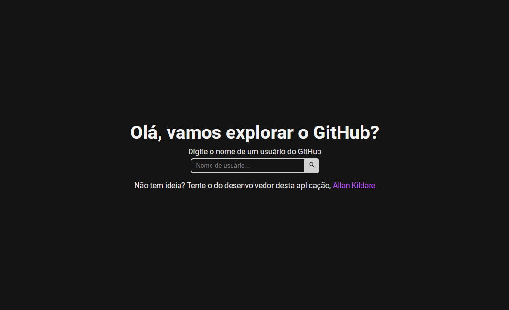

# GitHub Explorer

    

Esta aplicação é um desafio maior, buscando ultrapassar alguns horizontes de quando fiz uma aplicação usando HTML, CSS e JavaScript Vanilla (disponível [neste repositório](https://github.com/allankildare/github-api)).

Você poderá:
- Buscar/Listar todos os repositórios publicos de um usuário do github
- Dado um repositório, listar todas as branches
- Dado uma branch, listar todos os commits daquela branch

Se trata de um desafio técnico e no tempo oferecido eu consegui desenvolver satisfatoriamente o proposto. Ainda assim, existem pontos de melhorias já mapeadas, são elas:
- [ ] Separação de componentes independentes
- [ ] Criação de estilizações em módulos do Sass (possível criação de um tema)
- [ ] Adição de regras do Eslint para melhorar a experiência de desenvolvimento e boas práticas de código
- [ ] Instalação do Jest e Testing Library, criação de testes unitários

### Como instalar
Para clonar, você precisará ter configurado a autenticação SSH _(fortemente recomendada)_:

`git clone git@github.com:allankildare/github-explorer.git`

Ao clonar, abra o diretório do projeto e instale as dependências:

`yarn install`

### Rodar o projeto
O comando usado é o padrão `dev`, para isso rode em seu terminal o seguinte comando:

`yarn dev`

Sua aplicação estará rodando por padrão na [porta 3000](http://localhost:3000) _(verifique se está disponível)_

### Deploy
Para fazer o _deploy_ usei o serviço gratuito da Netlify, o website está disponível [neste link](https://github-explorer-allankildare.netlify.app/).